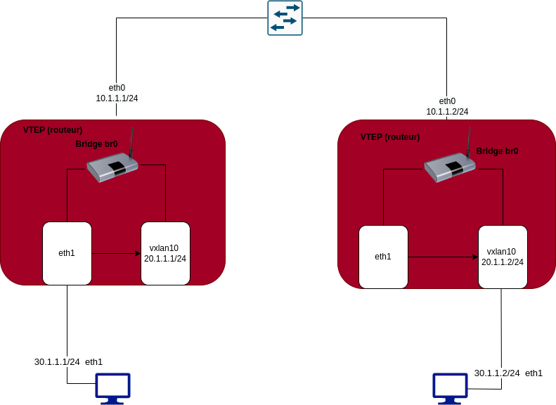

# BADASS
in progres

### Part one : 
[Simulez des architectures réseaux avec GNS3](https://openclassrooms.com/en/courses/2581701-simulez-des-architectures-reseaux-avec-gns3)

[GNS3 intro](https://www.youtube.com/playlist?list=PLLIV0VIvYuAMqJZm-Ulr1qiMGzH6f0OVl)

[GNS3: FRRouting Using Docker Platform](https://www.youtube.com/watch?v=D4nk5VSUelg)

### Part two : 
[RFC 7348](https://www.rfc-editor.org/rfc/rfc7348.txt)

[What is VXLAN ?](https://www.youtube.com/watch?v=WMLSD2y2Ig4&t=1091s)

[GNS3: FRRouting Using Docker Platform - VXLANs](https://www.youtube.com/watch?v=u1ka-S6F9UI&t=193s)
#### P2 Schema :

### Part three : 
[GNS3: FRRouting Using Docker Platform - EVPN](https://www.youtube.com/watch?v=Ek7kFDwUJBM&t=493s)

[What is MPLS](https://www.youtube.com/watch?v=3gm321tOxho)

### others utile docs:
[Difference between Underlay Network and Overlay Network ?](https://ipwithease.com/difference-between-underlay-network-and-overlay-network/)

[what is : node, host, 0.0.0.0 vs 127.0.0.1 ?](https://www.youtube.com/watch?v=91PrPbuHdhg)

[What is  Bridge in networking ?](https://www.youtube.com/watch?v=OBlJ3QuEt9k)

[spanning Treee](https://www.youtube.com/watch?v=CiO9k4Rxskk&t=272s)
